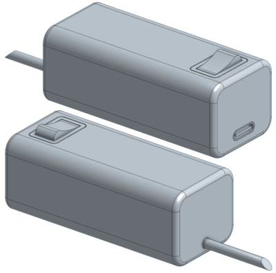

# EcoSwitch

Dieses Repository enthält das Projekt im Rahmen des Moduls **Soft Skills und technische Kompetenz** an der Carl von Ossietzky Universität Oldenburg.

## 📌 Gruppe 9

**Teilnehmer:innen:**
- Vlada Kryvtsova (vlkkvl)
- Emelie Lyhs (LuciaDC245)
- Rostyslav Petrenko (Rostikslav)
- Maximilian Schmidt (DerTafel)
- Zinedin Zerarka (Shuvi12345)

## 📁 Struktur

- `app/` – Android-Applikation
- `embedded/` – Hardware und Mikrocontroller-Firmware
- `docs/` – Projektbezogene Dokumentation

## 📝 Projektbeschreibung

Ursprünglich war geplant, eine vollwertige, fernsteuerbare Steckdosenleiste zu entwickeln, mit der sich Geräte über WLAN kontrollieren lassen. Diese Idee wurde jedoch aus sicherheitstechnischen Gründen abgelehnt, da sie mit Netzspannung gearbeitet hätte und dadurch ein erhöhtes Risiko bestand.

Stattdessen wurde das Konzept angepasst: Unser aktuelles Projekt, der EcoSwitch, verfolgt dieselben Ziele – nämlich Energieeinsparung und intelligentes Gerätemanagement – aber in Form eines kompakten USB-basierten Adapters. Diese Lösung reduziert das Gefahrenpotenzial erheblich, behält aber alle geplanten Funktionen bei.

Der EcoSwitch ermöglicht:
- Fernsteuerung über eine Android-App (WLAN)
- Timer-gesteuertes Ein-/Ausschalten von angeschlossenen Geräten
- Lokale Steuerung per Taster
- LED-Statusanzeige für den aktuellen Zustand

Das Projekt zielt darauf ab, unnötigen Stromverbrauch zu reduzieren, die Lebensdauer von Geräten zu verlängern und einen kleinen, aber effektiven Beitrag zum Umweltschutz zu leisten.